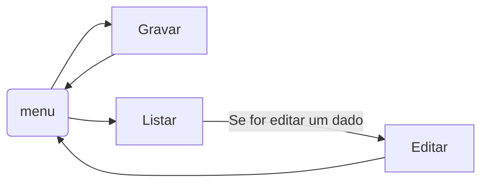

# Projeto Mobly - Futebol

# Passos para rodar o sistema

1- Ligar o Apash e o My Sql no  **Xampp Controll**  pois sem isso não vai ter ligação com o banco de dados.

2- Colocar o projeto no **htdocs** segue exemplo abaixo:
- C:\xampp\htdocs.

3 -  Criar um novo banco no phpmyadmin, pode ser acessado através desse link : 
- [http://localhost/phpmyadmin](http://localhost/phpmyadmin)

4- Importar o arquivo **bdteam.sql** da pasta **mobly** para inserir as tabelas do mesmo.

5-  Depois de ter feito isso, teremos que  ir na barra de pesquisa e colocar o link abaixo:
- [http://localhost/mobly/](http://localhost/mobly/)

5- Nas pastas que aparecer clicar na de **MENU.php** e seguir o fluxo do site.

Fluxo grama:

